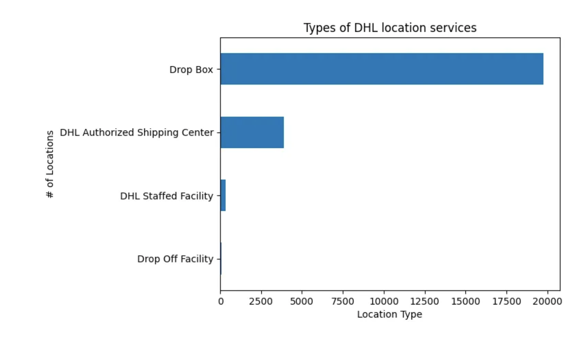
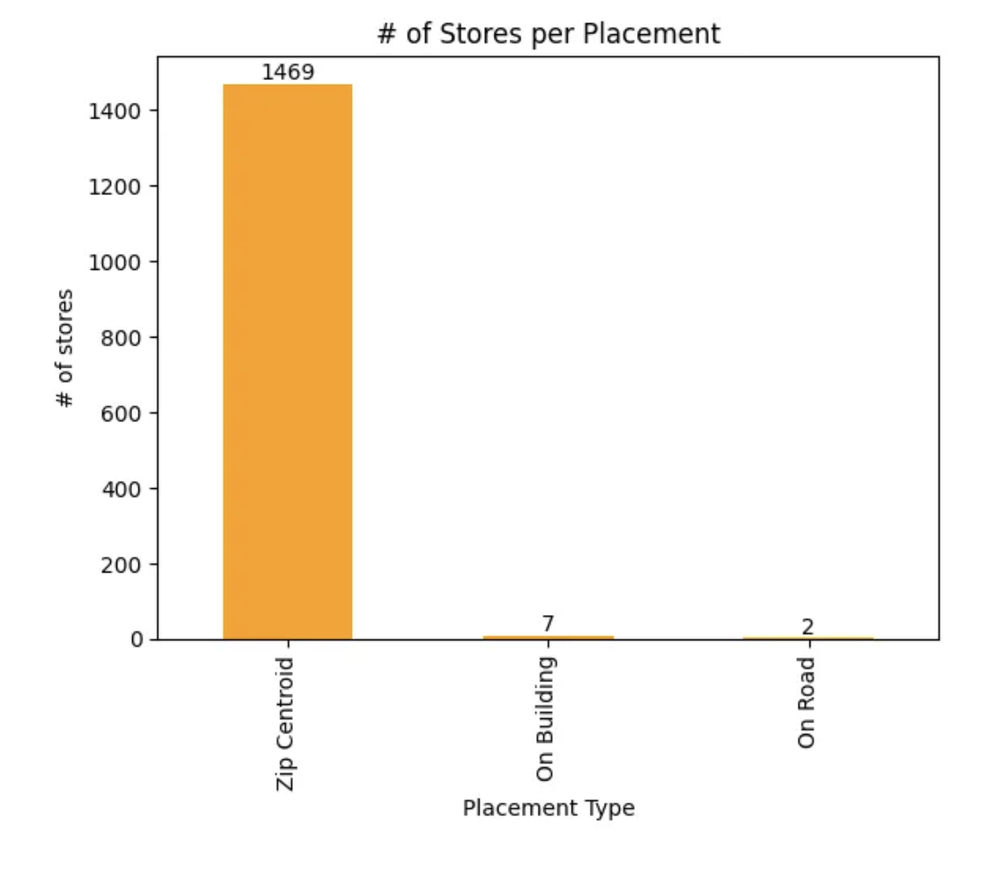
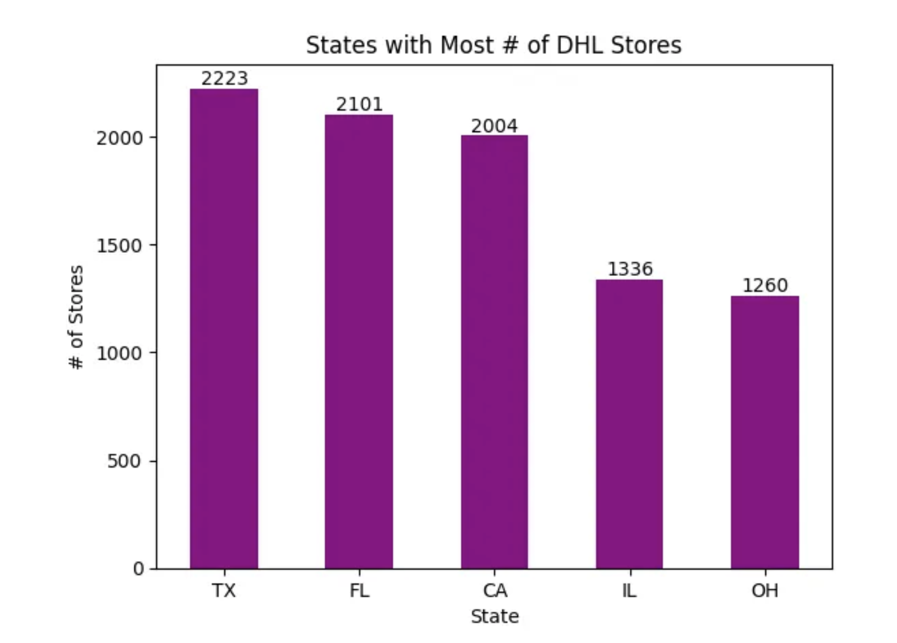
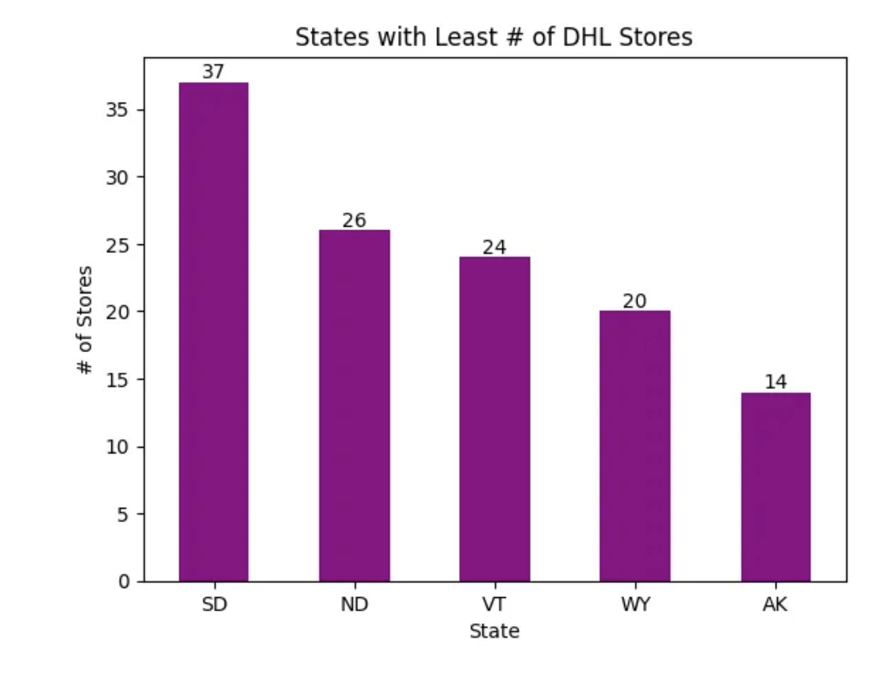
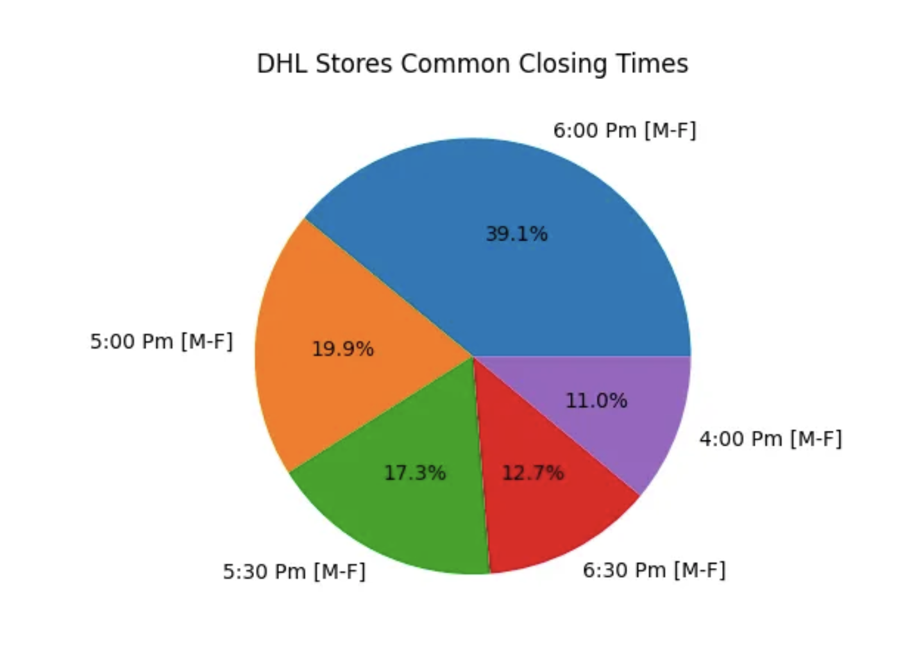
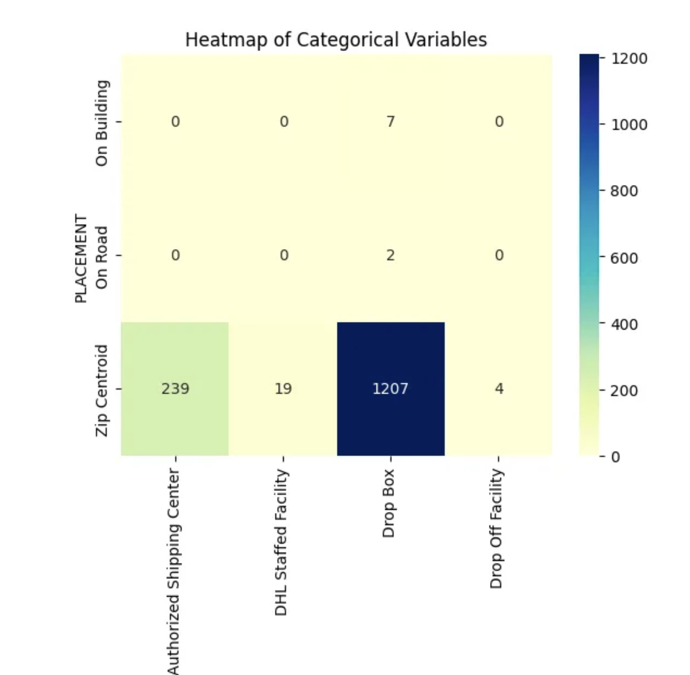

# DHL Facilities Insights - Project Overview

## The goal of this project is to investigate different DHL facilities and their operations across the USA in order to surface recommendations on the providing optimal operation hours, and services.

Founded in the 1960s, DHL is a multinational logistics brand delivering over 1.7 billion parcels every year. It operates a vast network of service points across multiple locations. To optimize service delivery and improve customer satisfaction, it is essential to analyze operational data and identify patterns related to store placement, common location services, and peak pickup closing times.

However, **with a growing network of service points, identifying inefficiencies and optimizing pickup schedules becomes challenging**. 

We are going to leverage EDA techniques using Python (pandas, seaborn, matplotlib) to uncover actionable insights that can enhance operational efficiency, reduce delays, and streamline resource allocation.

### Key Objectives:

- Identify the most common services offered at different locations.
- Analyze the distribution of store placements to determine optimal locations.
- Evaluate pickup closing times to identify peak hours and suggest adjustments for improved service delivery.

# Data Structure
The dataset consist of only one table - DHL_Facilities with all the information on location, type of services, latitude, longitude, address. 

# Insights Summary

To better understand the operational patterns and optimize service delivery, we focused on the following key areas:

*Common Location Services:* The types of services offered at DHL facilities.
*Store Placements:* The most frequent placement types of DHL service points.
*State Distribution:* States with the highest and lowest number of DHL stores.
*Pickup Closing Times:* The most common closing times for last pickups.

## Common Location Services
Our analysis revealed that Drop Box and DHL Authorized Shipping Centers are the most common facility types.

**Drop Box:** Self-service drop-off points often located in public areas like malls and grocery stores, enabling customers to leave packages conveniently.
**DHL Authorized Shipping Center:** Third-party businesses (e.g., OfficeMax or Bank of America) that accept shipments on DHL’s behalf.
**DHL Staffed Facility:** Fully staffed DHL service points that manage all DHL-related operations.
**Drop-off Facility:** Designated locations (within other businesses) where customers can drop off packages for DHL to process.

## Common Store Placements
Zip Centroid emerged as the most common placement type, accounting for over 90% of service points.

**Zip Centroid:** Central points within ZIP codes, strategically placed to serve the maximum population.
**On Road:** Facilities positioned along highways for ease of access and efficient logistics.
**On Building:** Locations attached to commercial buildings, such as office complexes or shopping centers, enhancing customer convenience.

## States with Most/Least Stores
**Top 5 States:** Texas, Florida, and California rank highest in terms of DHL facilities, reflecting regions with high demand for courier and logistics services.

**Bottom 5 States:** Alaska and Wyoming have the lowest number of facilities, likely due to sparse population and lower demand.

## Last Pickup Closing Times
The most common last pickup closing time across facilities is 6 PM from Monday to Friday, ensuring that customers can drop off packages after regular business hours.

# Key Insights

## High Correlation in Store Placement:
Drop Boxes and DHL Authorized Shipping Centers are highly correlated with Zip Centroid placement, suggesting that self-service and third-party locations are strategically positioned for maximum service coverage.

## Service Expansion Opportunities:
Since Drop Boxes and Authorized Shipping Centers dominate facility types, DHL can focus on expanding these services in high-traffic areas such as urban and suburban regions.

## Pickup Time Optimization:
Understanding peak closing times can help DHL tailor services to meet customer needs more efficiently.

# Recommendations

**Expand Drop Box and Shipping Centers:** Prioritize adding facilities in high-traffic urban and suburban areas to improve customer convenience.
**Optimize Store Placement:** Continue leveraging Zip Centroid placements to ensure that self-service locations and third-party partners serve densely populated areas effectively.
**Review Closing Time Patterns:** Consider adjusting pickup times to align with peak drop-off hours, enhancing service availability in critical regions.
